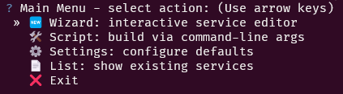
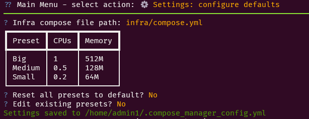
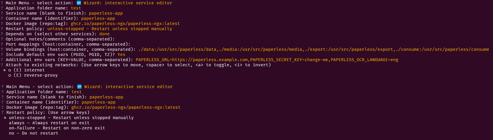
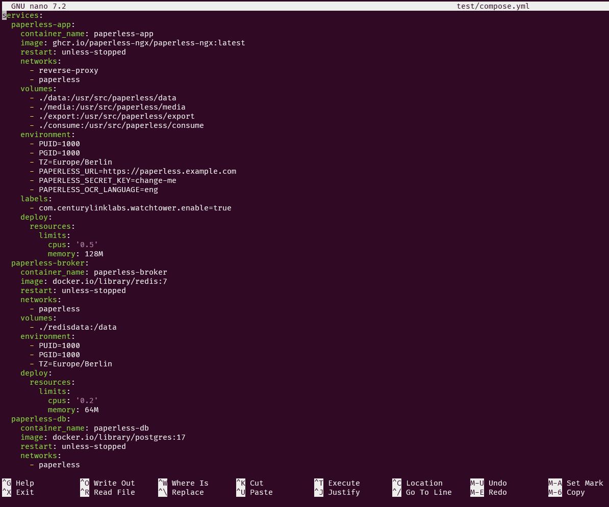
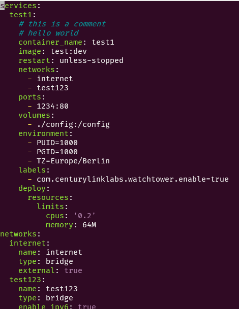

# Compose Manager CLI

> Easy, interactive CLI tool to generate and manage docker compose YAML files with consistent ordering, rich console output, and inline documentation. Includes both a wizard-driven interface and a scriptable build mode.

 

## 🚀 Quick Start

### 1. Clone and bootstrap

```bash
git clone https://github.com/Rabenherz112/compose-manager.git
cd compose-manager
chmod +x setup_env.py compose_manager.py
python3 setup_env.py
source .venv/bin/activate    # Windows: .\.venv\\Scripts\\activate.bat
```

This will create (if needed) a `./.venv` directory and install all required dependencies :

- click (CLI framework)
- ruamel.yaml (round-trip YAML editing)
- rich (styled console output)
- questionary (interactive prompts)
- pyyaml (config file parsing)

### 2. Launch the CLI

With your virtual environment activated:

```bash
python3 compose_manager.py
```

You’ll see an interactive main menu:

- Wizard: 🆕 Add or modify services step-by-step
- Script: 🛠️ Build a compose file via command-line options
- Settings: ⚙️ Configure default paths and resource presets
- List: 📄 View services in an existing compose file
- Exit: ❌ Quit the application

## 📸 Screenshots

Main menu:


Settings:



Some of the interactive prompts:


Resulting YAML file:




## 📋 Usage Examples

### 1. Wizard Mode

```bash
python3 compose_manager.py
# → Select “🆕 Wizard”
# → Enter application directory (e.g., "my_app")
# → Follow prompts to define container_name, image, ports, volumes, networks, etc.
```

### 2. Script Mode

Generates my_app/compose.yml with a single web service configured accordingly.

```bash
python3 compose_manager.py build \
  --app my_app \
  --service web:nginx:latest \
  --port 80:80 \
  --env TZ=Europe/Berlin --env DEBUG=1 \
  --volume ./data:/data \
  --preset Small
```

Displays a Rich table of all services, ports, networks, resource limits, and auto-update settings.

```bash
python3 compose_manager.py list my_app
```

## 💡 Why I created this

I created this tool to simplify my personal workflow when working with docker compose. I often found myself copy pasting YAML snippets from the internet (especially when setting up new services) and then having to manually edit them to fit my needs. This often resulted in me forgetting to change things, or having to look up the same information over and over again. I wanted a tool that would allow me to quickly and easily generate docker compose files in the format I want.

Since I thought this might be useful for others as well, I published it. However since this is my personal tool, I will likely neither expand it to support all use cases, nor will I maintain it in the long run. This was first and foremost a tool which I use for myself. If you find it useful, great! If not, feel free to either submit a PR or fork it and make it your own. I will not be offended if you do so. I just ask you to keep the license in mind.

## 📜 License

This project is licensed under the GNU AGPL v3.0. See the [LICENSE](./LICENSE) file for details.
